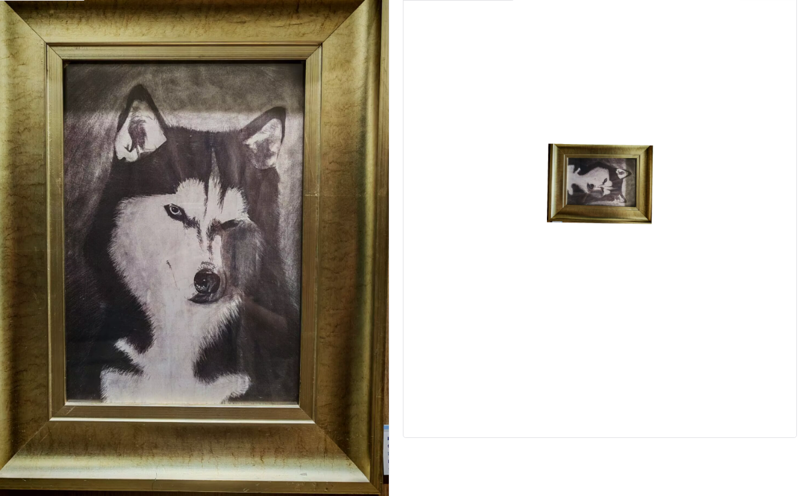
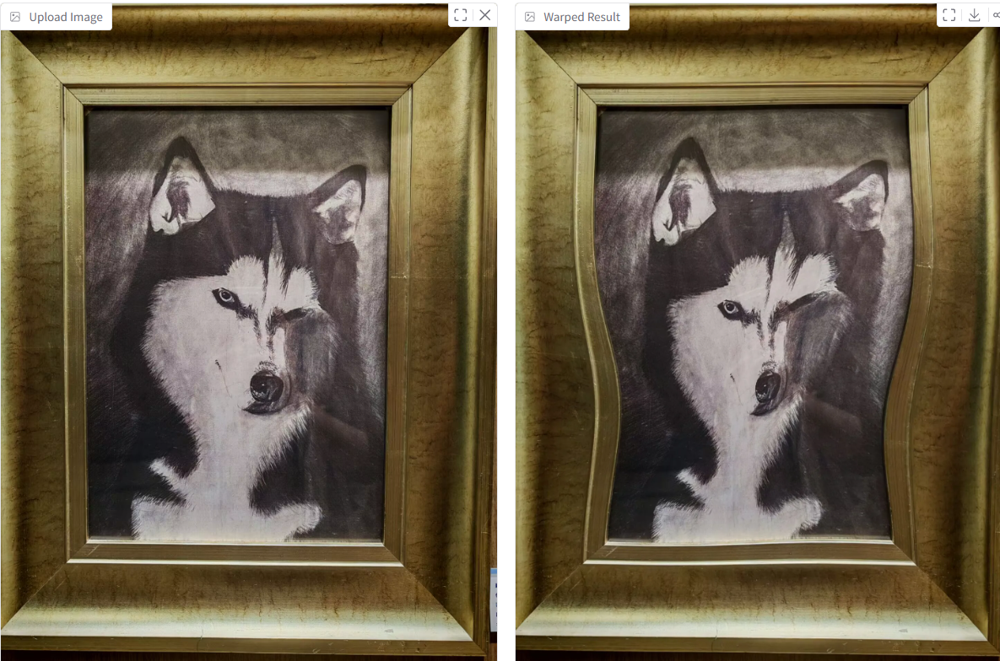

# 数字图像处理作业 1：图像形变（Image Warping）

# 1. 作业简介

本次作业实现了两个图像形变任务，并使用 Gradio 搭建了交互界面，方便对结果进行可视化测试。

主要包括以下两部分：

## 1. 全局几何变换
   缩放 旋转 平移 翻转

## 2. 基于控制点的图像形变
   采用基于 RBF基函数，实现通过原点和目标点实现图像变化

# 2.运行方法
```bash
python run_global_transform.py
```
```bash
python run_point_transform.py
```
复制链接进入
# 3. 实验结果展示

## 3.1 全局几何变换结果



## 3.2 控制点图像形变结果


