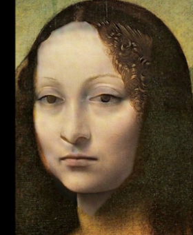

# HW2: DIP with PyTorch

本作业包含两个部分：

1. `Part 1`：Poisson Image Editing
2. `Part 2`：Pix2Pix on CMP Facades

## Environment

本机运行环境：

```powershell
& 'C:\Users\admin\Miniconda3\envs\dip_pt\python.exe'
```

依赖安装：

```powershell
& 'C:\Users\admin\Miniconda3\envs\dip_pt\python.exe' -m pip install -r requirements.txt
```

## Part 1: Poisson Image Editing

实现文件：`part1_poisson.py`

主要内容：

1. 使用多边形点生成前景区域 `mask`
2. 使用 `conv2d` 构造 Laplacian loss
3. 使用 `Adam` 优化融合区域像素
4. 用 `base/a1.png` 和 `base/a2.png` 测试 IPE 效果

运行方式：

```powershell
& 'C:\Users\admin\Miniconda3\envs\dip_pt\python.exe' .\part1_poisson.py --run-both-examples --iterations 1200 --device cpu
```

输出目录：

```text
outputs/part1/
```

其中包括：

1. 原图
2. polygon 可视化
3. mask
4. naive clone
5. poisson blending result

结果示例：

`a1 -> a2`



`a2 -> a1`


## Part 1 Demo

实现文件：`part1_gradio_demo.py`

支持功能：

1. 上传前景图和背景图
2. 在前景图上点击选取多边形顶点
3. 闭合 polygon
4. 使用滑条移动选中的前景区域
5. 执行 blending 并显示结果

运行方式：

```powershell
& 'C:\Users\admin\Miniconda3\envs\dip_pt\python.exe' .\part1_gradio_demo.py
```

## Part 2: Pix2Pix

实现文件：`part2_pix2pix.py`

数据集：

1. `base/cmp_bXXXX.png` 作为输入语义图
2. `base/cmp_bXXXX.jpg` 作为目标真实图像

主要内容：

1. 自动读取并配对数据
2. 使用轻量级 `U-Net` 作为 Generator
3. 使用 `PatchGAN` 作为 Discriminator
4. 使用 adversarial loss + L1 loss
5. 输出验证集预测结果与训练过程样例图

正式训练命令：

```powershell
& 'C:\Users\admin\Miniconda3\envs\dip_pt\python.exe' .\part2_pix2pix.py train `
  --data-dir base `
  --output-dir outputs/part2 `
  --epochs 20 `
  --batch-size 4 `
  --image-size 256 `
  --load-size 286 `
  --base-channels 32 `
  --device cpu
```

单张推理命令：

```powershell
& 'C:\Users\admin\Miniconda3\envs\dip_pt\python.exe' .\part2_pix2pix.py predict `
  --checkpoint outputs/part2/checkpoints/best.pt `
  --input base/cmp_b0001.png `
  --output outputs/part2_single/cmp_b0001.png `
  --image-size 256 `
  --device cpu
```

输出目录：

```text
outputs/part2/
```

包括：

1. `checkpoints/best.pt`
2. `checkpoints/last.pt`
3. `samples/epoch_XXX.png`
4. `predictions/*.png`
5. `train_history.json`

## Result

`Part 1` 已生成 `a1.png` 和 `a2.png` 的 Poisson blending 结果。  
`Part 2` 已完成 20 个 epoch 的训练，并保存了 `best.pt`、`last.pt` 和验证样例图。

本次训练中较好的结果出现在较早 epoch，最终可优先使用：

```text
outputs/part2/checkpoints/best.pt
```

## File Structure

```text
.
├─ base/
├─ outputs/
├─ part1_poisson.py
├─ part1_gradio_demo.py
├─ part2_pix2pix.py
├─ requirements.txt
└─ README.md
```
